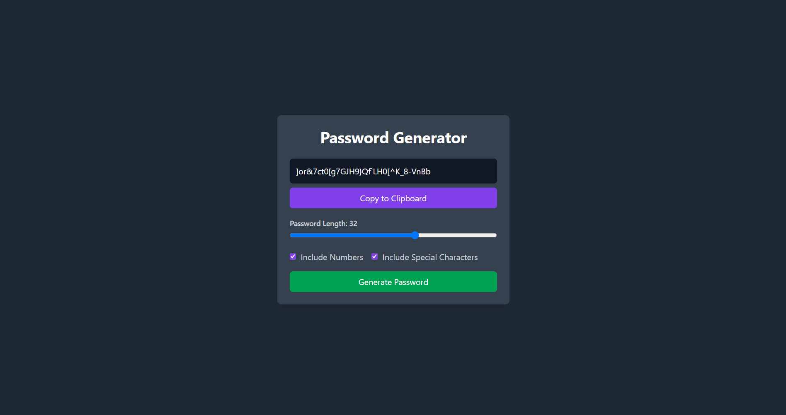

# Password Generator App

A React-based **Password Generator** application that allows users to create secure passwords with customizable options such as length, inclusion of numbers, and special characters.

---

## Features

- **Password Length**: Adjustable slider to set password length (4-50 characters).
- **Include Numbers**: Option to include numeric digits in the password.
- **Include Special Characters**: Option to include special characters.
- **Password Display**: Displays the generated password.
- **Copy to Clipboard**: Copy the generated password to the clipboard with a single click.

---

## Demo Screenshot



---

## Installation

1. Clone this repository:
   ```bash
   git clone https://github.com/your-username/password-generator.git
